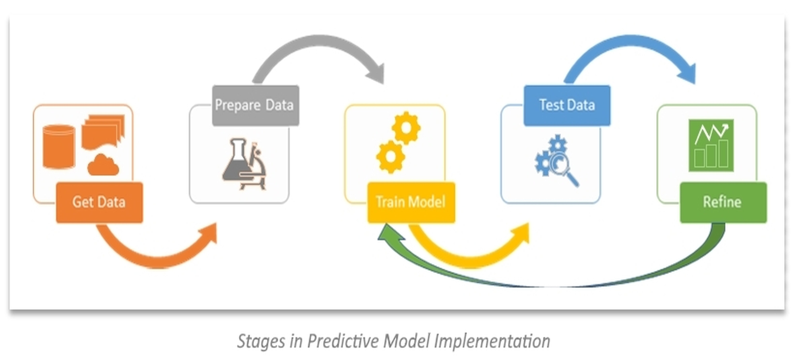

# Hello! This is Shruthi Sree

## About Me

I'm a data analyst and data engineer with over 3 years of experience turning complex business problems into actionable solutions. My passion lies in uncovering insights that drive growth, reduce costs, and empower strategic decisions. Whether building full-stack data platforms or crafting executive dashboards, I leverage advanced analytics (Python, Spark, SQL) and BI tools (Tableau, Power BI) to illuminate trends and opportunities.

I've led analytics projects across SaaS, retail, and operations – from predicting customer churn and optimizing ARPU to engineering robust ETL pipelines. My collaborative approach ensures stakeholders at every level understand the value behind the numbers and are equipped to act on clear, data-driven recommendations.

If you're looking for someone who combines deep technical expertise with business acumen and a knack for making data meaningful, let's connect – I thrive on partnering to solve big challenges and deliver measurable results.

## Projects

  <a href="https://github.com/shruthisree1234/SaaS_Churn_Prediction" style="text-decoration: none; color: inherit; display: block;">
    

      
      

        <h3 style="margin: 0 0 10px 0; font-weight: bold;">SaaS Churn Prediction</h3>
        
A deep-dive analytics project on SaaS KPIs: customer segmentation, churn, ARPU, margin, contracts, and marketing spend. Includes business recommendations driven by data and executive-level dashboards.

      

    

  </a>

  <a href="https://github.com/shruthisree1234/Data-Engineering-End-End-Project" style="text-decoration: none; color: inherit; display: block;">
    

      
      

        <h3 style="margin: 0 0 10px 0; font-weight: bold;">End-to-End Data Pipeline</h3>
        
A comprehensive, real-world data platform project simulating retail analytics with MySQL, MongoDB, Hadoop, Spark, Airflow, IBM DB2, and more. Includes schema design, ETL automation, and dashboarding.

      

    

  </a>

  <a href="https://github.com/shruthisree1234/Bike_Rental_system" style="text-decoration: none; color: inherit; display: block;">
    

      
      

        <h3 style="margin: 0 0 10px 0; font-weight: bold;">Performance Monitoring and Visualization - Product Rental System </h3>
        
Database-driven bike rental management system designed to mirror the real-world operations of a vehicle rental business

      

    

  </a>

  <a href="https://github.com/shruthisree1234/DW-design-and-MQT" style="text-decoration: none; color: inherit; display: block;">
    

      
      

        <h3 style="margin: 0 0 10px 0; font-weight: bold;">Data Warehouse Design for Operational Analytics </h3>
        
End-to-end design and implementation of a Data Warehouse for operation analytics

      

    

  </a>

  <a href="https://github.com/shruthisree1234/Airfoil-Noise-Prediction" style="text-decoration: none; color: inherit; display: block;">
    

      
      

        <h3 style="margin: 0 0 10px 0; font-weight: bold;">Predictive Modeling of Airfoil Acoustic Performance </h3>
        
End-to-end machine learning pipeline for predicting the self-noise generated by airfoils using real-world data and Spark ML.

      

    

  </a>

  <a href="https://github.com/shruthisree1234/Sentiment-Analysis" style="text-decoration: none; color: inherit; display: block;">
    

      
      

        <h3 style="margin: 0 0 10px 0; font-weight: bold;">Sentiment Analysis </h3>
        
Compares multiple machine learning and deep learning models (SVM, LSTM, and CNN) for automated sentiment classification of text. Each approach highlights different strengths in understanding sentiment from language data.

      

    

  </a>

  <a href="https://github.com/shruthisree1234/Face_mask_detection" style="text-decoration: none; color: inherit; display: block;">
    

      
      

        <h3 style="margin: 0 0 10px 0; font-weight: bold;">Face mask detection </h3>
        
Implements and compares deep learning models for real-time face mask detection using computer vision. The focus is on building efficient pipelines for recognizing whether individuals in images or video streams are wearing face masks for public health and safety.

      

    

  </a>

  <a href="https://github.com/shruthisree1234/Regression_ML" style="text-decoration: none; color: inherit; display: block;">
    

      
      

        <h3 style="margin: 0 0 10px 0; font-weight: bold;">Regression ML Pipeline </h3>
        
A complete machine learning pipeline using PySpark to predict car mileage (MPG) from multidimensional automotive data. Designed with a focus on real-world data engineering, the workflow bridges robust ETL, advanced regression modeling, performance evaluation, and production model persistence—showing how scalable data science is applied in industry.

      

    

  </a>

  <a href="https://github.com/shruthisree1234/GUI-for-sorting-algorithms" style="text-decoration: none; color: inherit; display: block;">
    

      
      

        <h3 style="margin: 0 0 10px 0; font-weight: bold;">Interactive Sorting Algorithms Visualizer </h3>
        
a graphical user interface (GUI) tool for visualizing and comparing classic sorting algorithms in real time. It helps users understand, analyze, and benchmark the inner workings of sorting methods.

      

    

  </a>

