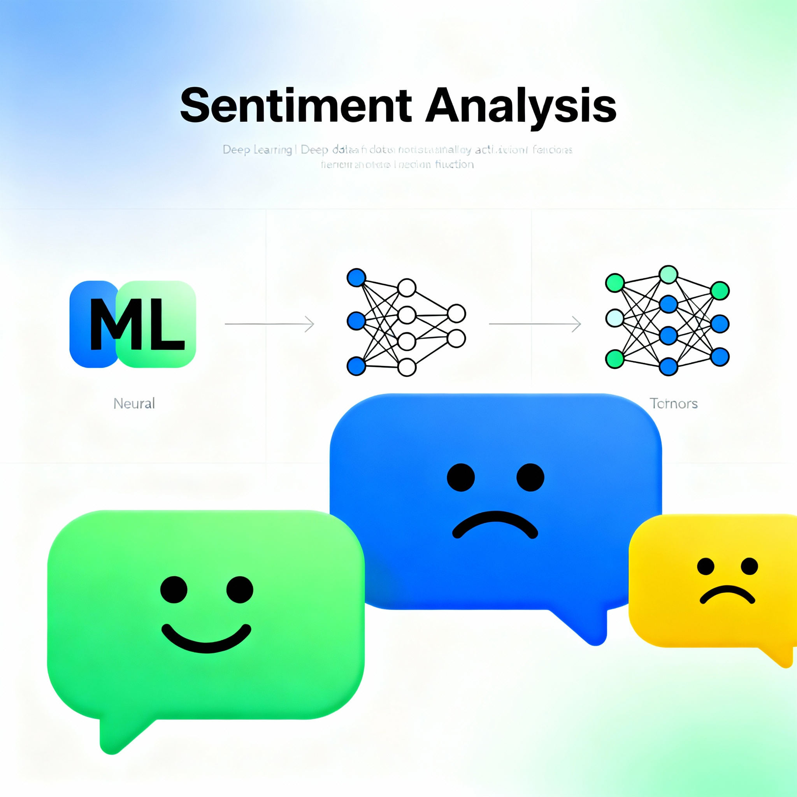
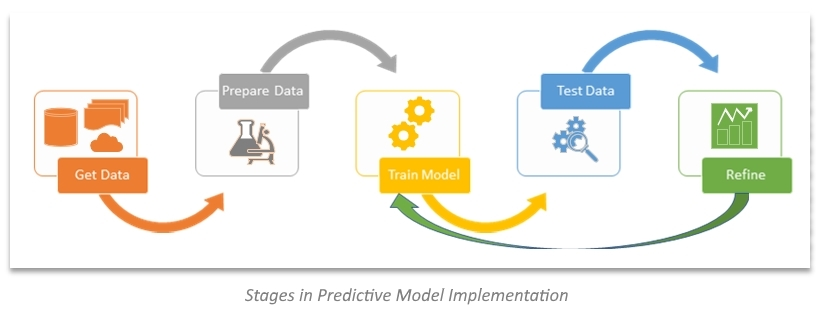
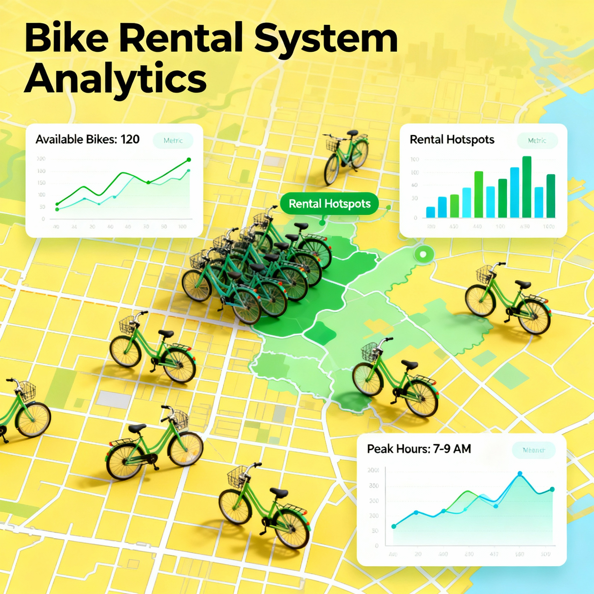
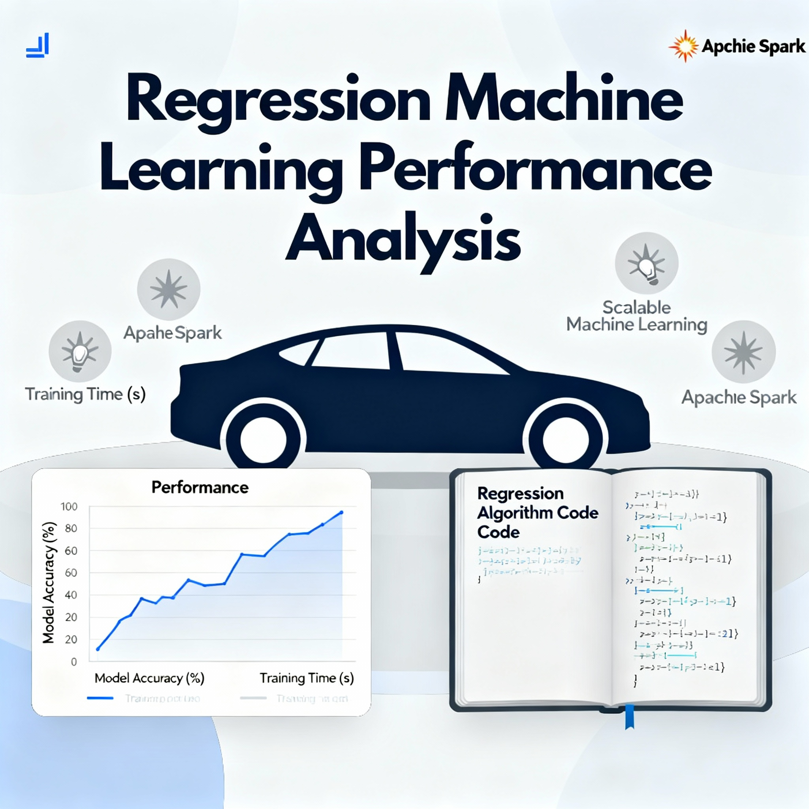
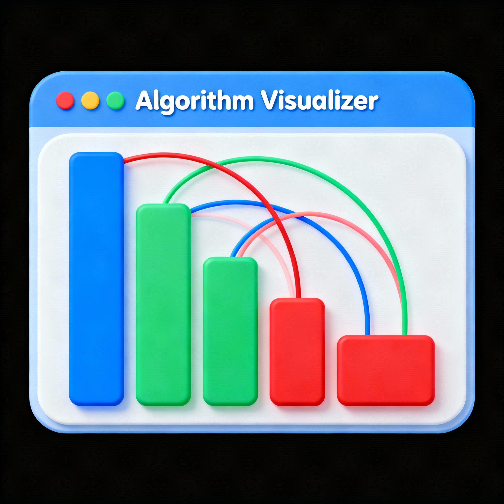

<!-- Responsive Navigation for GitHub Pages (works in Markdown) -->

<nav class="nav container">
  <button class="hamb" id="hamb" aria-expanded="false" aria-controls="menu">☰</button>
  

    <a href="#about">About</a>
    <a href="#accomplishments">Accomplishments</a>
    <a href="#projects">Projects</a>
    <a href="#skills">Skills</a>
    <a href="#education">Education</a>
  

</nav>

<section id="about">

# Shruthi Sree - Data Analyst

Welcome! I am an aspiring data analyst with a strong foundation in statistical analysis, data visualization, and machine learning. I enjoy transforming raw data into actionable insights that drive business decisions.

📧 Email: shruthisree1234@gmail.com  
🔗 [LinkedIn](https://www.linkedin.com/in/shruthi-sree-58b856320/)  
💻 [GitHub](https://github.com/shruthisree1234)

</section>

<section id="accomplishments">

## 🏆 Accomplishments

- **HackerRank SQL Gold Badge**: Demonstrated proficiency in writing complex SQL queries.
- **Certifications**: Completed courses in Data Analysis, Machine Learning, and Python from Coursera and Udemy.
- **University Projects**: Led multiple data-driven projects during my academic tenure.

</section>

<section id="projects">

<h2 class="section-title">📂 Projects</h2>

  <h3>Product Analytics</h3>
  

    

      
      <h3>Customer Churn Analysis</h3>
      
Analyzed customer churn patterns using SQL and visualization tools to identify key factors affecting retention.

      

        SQL
        Power BI
        Excel
      

    

    
    

      
      <h3>Data Pipeline Project</h3>
      
Built an automated data pipeline to extract, transform, and load data from multiple sources for analytics.

      

        Python
        ETL
        PostgreSQL
      

    

  

  <h3>Operational Analytics</h3>
  

    

      
      <h3>Operational Efficiency Analysis</h3>
      
Evaluated operational data to optimize resource allocation and reduce costs by 15%.

      

        Tableau
        SQL
        Excel
      

    

    
    

      
      <h3>Sentiment Analysis Dashboard</h3>
      
Created a sentiment analysis tool to monitor customer feedback and identify improvement areas.

      

        Python
        NLP
        Power BI
      

    

  

  <h3>Healthcare Analytics</h3>
  

    

      
      <h3>Healthcare Predictive Modeling</h3>
      
Developed predictive models to forecast patient readmission rates using logistic regression.

      

        Python
        Scikit-learn
        Pandas
      

    

  

  <h3>Machine Learning & Visualization</h3>
  

    

      
      <h3>Bike Rental Demand Prediction</h3>
      
Predicted bike rental demand using linear regression and time series analysis.

      

        Python
        Machine Learning
        Matplotlib
      

    

    
    

      
      <h3>Regression Models Comparison</h3>
      
Compared various regression techniques to determine the best model for sales forecasting.

      

        Python
        Scikit-learn
        Seaborn
      

    

    
    

      
      <h3>Algorithm Visualization Tool</h3>
      
Developed an interactive tool to visualize sorting and searching algorithms for educational purposes.

      

        JavaScript
        D3.js
        HTML/CSS
      

    

    
    

      
      <h3>Face Mask Detection System</h3>
      
Built a CNN-based system to detect face masks in real-time using OpenCV and TensorFlow.

      

        Python
        TensorFlow
        OpenCV
      

    

  

</section>

<section id="skills">

## 🛠️ Skills

**Programming Languages**: Python, SQL, R  
**Data Visualization**: Tableau, Power BI, Matplotlib, Seaborn  
**Data Analysis**: Excel, Pandas, NumPy  
**Machine Learning**: Scikit-learn, TensorFlow  
**Database**: MySQL, PostgreSQL, MongoDB  
**Tools**: Git, Jupyter Notebook, VS Code

</section>

<section id="education">

## 🎓 Education

**Bachelor of Technology in Computer Science**  
Dayananda Sagar College of Engineering, Bangalore  
Graduation Year: 2026  
CGPA: 8.5/10

</section>

---

© 2024 Shruthi Sree. All rights reserved.

